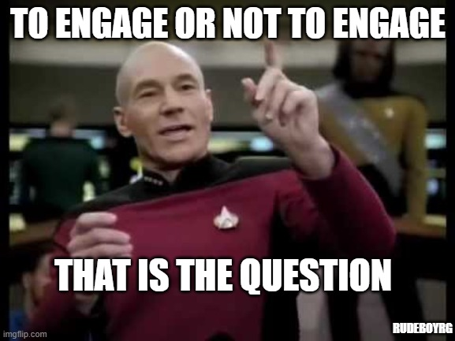

# Arduino Experiments
## About
* Some notes from my first foray working with and programming microcontroller devices 
* Explores the Arudino (Uno) Starter Kit and provided tutorials, and other amateur shenanigans

## Setup
In addition to the project manual, these docs were helpful with getting started:
* [Getting Started with Arduiono IDE 2.0](https://docs.arduino.cc/software/ide-v2/tutorials/getting-started-ide-v2)

### Arduino IDE 2.0 Installation
* I used the appImage installation option for `linux`
* Don't forget to enable permissions to run: `Properties > Permissions > Execute: > Click Allow executing file as program`


### Error on Blink Demo
One issue I encountered with uploading programs using the IDE:

```
Sketch uses 924 bytes (2%) of program storage space. Maximum is 32256 bytes.
Global variables use 9 bytes (0%) of dynamic memory, leaving 2039 bytes for local variables. Maximum is 2048 bytes.
avrdude: ser_open(): can't open device "/dev/ttyACM0": Permission denied
Failed uploading: uploading error: exit status 1
```

And the [resolution](https://askubuntu.com/questions/1056314/uploading-code-to-arduino-gives-me-the-error-avrdude-ser-open-cant-open-d
):

```
(base) kckuei@kckuei-Precision-3560:~$ ls /dev/ttyACM0
/dev/ttyACM0
(base) kckuei@kckuei-Precision-3560:~$ sudo chmod a+rw /dev/ttyACM0

```

## Projects

### 01 Get to Know Your Tools
An electricity/circuits refresher, and how breadboards work primer.

#### Concepts
* transducers = convert other forms of energy to electrical energy or vice versa
* sensors = convert other forms of energy to electrical energy
* actuators = convert electrical energy to other forms
* circuits = are closed loop systems that convey electricity from a power source (e.g. battery) to something that does something useful (load)
* power flows from high to low potential
* ground generally point of least potential energy
* in DC circuits, flow is unidirectional
* in AC circuits, flow changes direction every 50 or 60 Hz
* current = amount of charge flowing past a point in circuit (amps)
* voltage = difference in energy between a point in a circuit and another (V)
* resistance = how much a component resists flow of current (ohms)
* V (voltage) = I (current) * R (resistance)
* Breadboard = protoyping board for building circuits that doesn't require soldering. Consists of multiple horizontal/vertical rows of conductive metal strips with wells that you can easily plug into.
* reading resistor bands
  * are either 4 or 5-band
  * the band colors are color-coded to digits
  * for 4-band resistors
    * 1st band = 1st digit
    * 2nd band = 2nd digit
    * 3rd band = number of trailing zeros/multiplier
    * 4th band = tolerance

#### Building a Simple, Series, and Parallel Circuit

<table>
  <theader>
    <tr>
      <th>Simple Circuit</th>
      <th>Series Circuit</th>
      <th>Parallel Circuit</th>
    </tr>
  </theader>
  <tbody>
    <tr>
      <td></td>
      <td></td>
      <td></td>
    </tr>
  </tbody>
</table>


### 02 Spaceship Interface
A digital I/O to mimic those snazzy 1970s sci-fi spaceship interfaces.



#### Concepts
* Skech = an Arduino computer program. Every sketch has two main functions: a `setup()` and `loop()` function. 
* The `setup()` function is run once at the start of the program, and the `loop()` function is run repeatedly like a while loop.
* The digital pins on the Arduino board can be used to listen for or recieve a signal (i.e. what is the state?) or trigger a response (i.e. set the state). The response is binary, i.e. it is either on/off (or low/high in terms of voltage).
* Use `pinMode()` to configure the digital pins as either inputs or outputs in `setup()`.
* Use `digitalRead()` to read a state (e.g., listen for a signal like a button push).
* Use `digitalWrite()` to set the state of a digital pin (e.g., light up a button).
* Use `delay()` to halt execution of the code for a set duration.

#### Beep-Boop

<table>
  <theader>
    <tr>
      <th>Press Button</th>
      <th>Toggle Button</th>
    </tr>
  </theader>
  <tbody>
    <tr>
      <td></td>
      <td></td>
    </tr>
  </tbody>
</table>


### 03 Love-O-Meter


